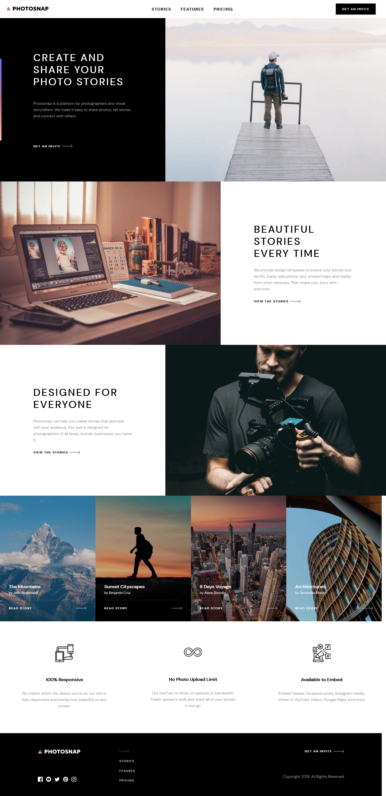

# Frontend Mentor - Photosnap Website solution

This is my solution to the [Photosnap Website challenge on Frontend Mentor](https://www.frontendmentor.io/challenges/photosnap-multipage-website-nMDSrNmNW). Frontend Mentor challenges help you improve your coding skills by building realistic projects.

## Table of contents

- [Overview](#overview)
  - [The challenge](#the-challenge)
  - [Screenshot](#screenshot)
  - [Links](#links)
- [My process](#my-process)
  - [Built with](#built-with)
  - [What I learned](#what-i-learned)
- [Author](#author)

## Overview

### The challenge

Users should be able to:

- View the optimal layout for each page depending on their device's screen size
- See hover states for all interactive elements throughout the site

### Screenshot



### Links

- Solution URL: [FrontEnd Mentor Solution](https://www.frontendmentor.io/solutions/photosnap-multipage-website-solution-w4qKDKUz_)
- Live Site URL: [PhotoSnap Live](https://modest-payne-c53e87.netlify.app/)

## My process

### Built with

- Semantic HTML5 markup
- CSS custom properties
- Flexbox
- CSS Grid
- Mobile-first workflow
- [React.js](https://reactjs.org/) - JS library
- [Gatsby.js](https://www.gatsbyjs.com/) - React framework
- [Styled Components](https://styled-components.com/) - For styles
- [Freamer Motion](https://www.framer.com/api/motion/) - For Dropdown menu Animation

### What I learned

- How to use Gatsby JS to generate blazing fast static websites.

- How to query Page component's data from file's with help of Gatsby's GraphQL.

```js
export const query = graphql`
    query FeaturesImages {
        allFile(filter: { sourceInstanceName: { eq: "features" } }) {
            edges {
                node {
                    id
                    childrenImageSharp {
                        gatsbyImageData(width: 2000, placeholder: BLURRED, quality: 100, formats: [AUTO, WEBP, AVIF])
                    }
                }
            }
        }
    }
`
}
```

- How to query data from non page components with help of Gatsby useStaticQuery hook:

```js
// Quering for images from file
const data = useStaticQuery(graphql`
  query MyQuery {
    allFile(
      filter: { sourceInstanceName: { eq: "home" } }
      sort: { fields: name, order: ASC }
    ) {
      edges {
        node {
          id
          childrenImageSharp {
            gatsbyImageData(
              width: 1400
              quality: 100
              placeholder: BLURRED
              formats: [AUTO, WEBP, AVIF]
            )
          }
        }
      }
    }
  }
`)
```

- How to structure Gatsby Layout Component to apply on every Page

```js
const Layout = ({ children }) => (
  <>
    <GlobalStyles />
    <Typography />
    <PageWrapper>
      <Nav />
      <main>{children}</main>
      <Footer />
    </PageWrapper>
  </>
)
```

and then apply it to every page automaticly from gatsby-browser.js file

```js
import React from "react"
import Layout from "./src/components/Layout"

// Wraps every page in Layout component, more in Gatsby doc's: https://www.gatsbyjs.com/docs/reference/config-files/gatsby-browser/#wrapPageElement
export function wrapPageElement({ element, props }) {
  return <Layout {...props}>{element}</Layout>
}
```

- How to use Gatsby Image from optimized Images

```js
// Assigning image from the array to its own variable
    const image1 = getImage(data.allFile.edges[0].node.childrenImageSharp[0])

// GatsbyImage component
    <GatsbyImage className="image-wrapper" image={image1} alt="numero uno" />
```

## Author

- Frontend Mentor - [@tosia921](https://www.frontendmentor.io/profile/tosia921)
- LinkedIn - [@Tomasz Posiadala](https://www.linkedin.com/in/tomasz-posiada%C5%82a-3a05391b0/)
